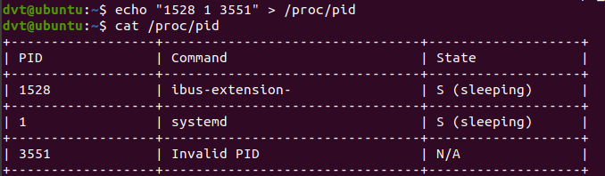
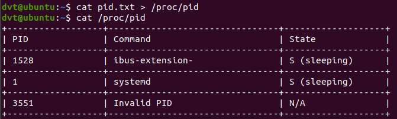
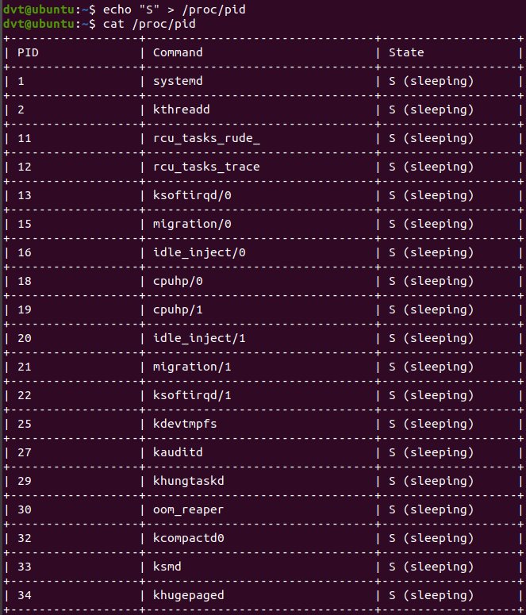
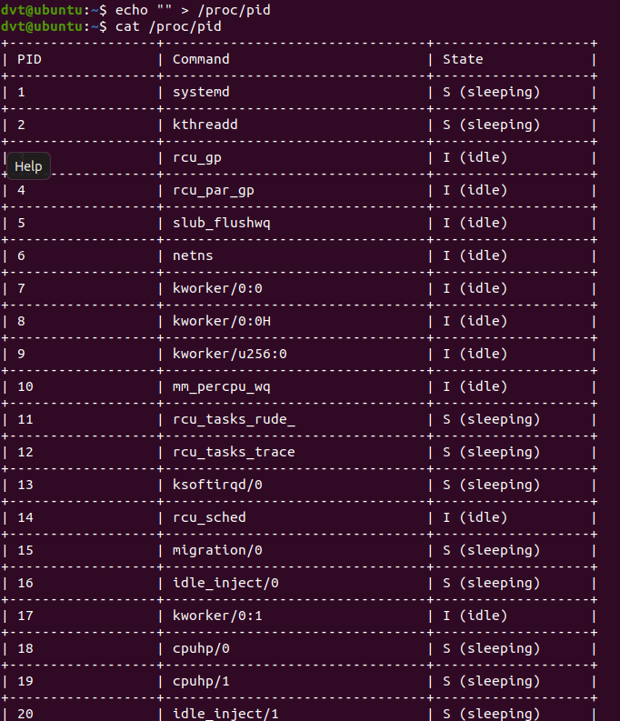

# Linux Kernel Module: Task Information Extractor

This is a course project for **Operating Systems (IT007.P11.CTTN)** at the University of Information Technology – VNU-HCM. The project involves developing a Linux Kernel Module (LKM) that extracts and displays detailed information about currently running processes (tasks) in the system.

## 📌 Features

- Traverses the Linux process list using `task_struct`.
- Extracts detailed task information:
  - Process name
  - PID and PPID
  - Process state
  - Current running CPU
  - User time and system (kernel) time
- Prints task information to the kernel log (`dmesg`).

## 🧠 Learning Objectives

- Understand Linux process management.
- Learn how to write and compile Linux kernel modules.
- Work with kernel data structures such as `task_struct` and `list_head`.
- Gain hands-on experience using tools like `Makefile`, `insmod`, `rmmod`, and `dmesg`.

## 🛠️ Installation & Usage

### Requirements

- A Linux-based system (Ubuntu recommended).
- Kernel headers installed.
- `make`, `gcc`, and root (sudo) privileges.

### Build and Insert the Module

```bash
make
sudo insmod task_info.ko
```
### Check Kernel Log Output
```bash
dmesg | tail -n 100
```
### Sample output:
```bash
Process: bash | PID: 1023 | PPID: 1001 | State: Running | CPU: 0 | utime: 1200 | stime: 300
...
```

### Remove the Module
```bash
sudo rmmod task_info
```
### 📷 Demonstration
<div align="center">

|  |  |
|----------------------|----------------------|
|  |  |

</div>


### 📁 File Structure
```bash
.
├── task_info.c           # Kernel module source code
├── Makefile              # Build script
├── demo1.png - demo4.png # Demonstration screenshots
```

### 📦 Versions

- [`Basic/`](./Basic) — Initial version of the kernel module
- [`Upgrade/`](./Upgrade) — Enhanced version with improvements and more features


### 🧑‍💻 Authors
Trần Gia Nghi\
Nguyễn Đa Vít\
Nguyễn Ngọc Diệu Duyên\
Vũ Hoàng Khôi

Course: Operating Systems (IT007.P11.CTTN)

#### 📄 License
This project is intended for educational purposes only. No license is applied.

#### 🙌 Contributions

Feel free to open issues or pull requests for suggestions or improvements.
---


